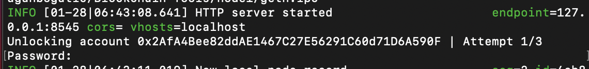
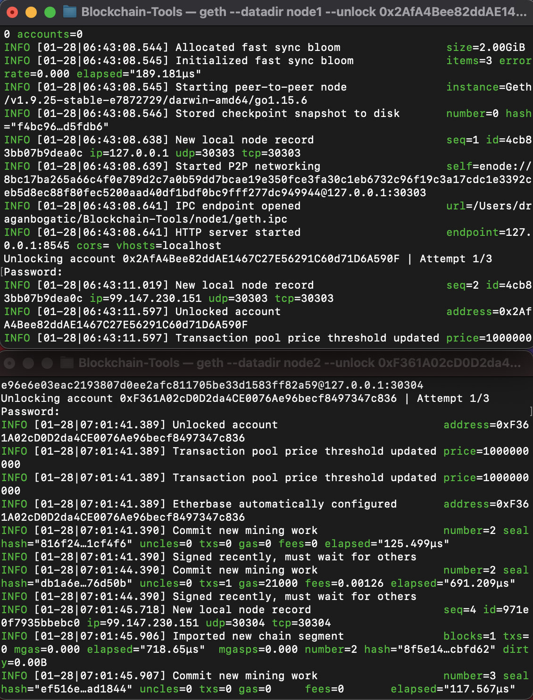

#
# Proof of Authority (PoA) Blockchain 

* [Setup a Proof of Authority (PoA) Blockchain with Geth](#setup-a-proof-of-authority-(poa)-blockchain-with-geth)

* [Send a Test Transaction](#send-a-test-transaction)

* [Verification of Transaction Completion](#verification-of-transaction-completion)
#
Source: [Pixabay](https://pixabay.com/vectors/blockchain-cryptocurrency-network-3277336/#)
#
Blockchain is a distributed decentralized network that provides immutability, privacy, security, and transparency. There is no central authority present to validate and verify the transactions, yet every transaction in the Blockchain is considered to be completely secured and verified. This is possible only because of the presence of the consensus protocol which is a core part of any Blockchain network. Source: [GeeksforGeeks](https://www.geeksforgeeks.org/consensus-algorithms-in-blockchain/)

This repository describes necessary steps to setup a testnet blockchain for an organization using Geth as well as to simulate a crypto transaction on the ETH network via MyCrypto application. The three main steps are:

* Setup a custom PoA testnet blockchain with [Geth](https://geth.ethereum.org/).

* Send a test transaction.

* Verify that test transaction was recorded in our blockchain and registered in our [MyCrypto](https://mycrypto.com/account) account.

#
### Setup a Proof of Authority (PoA) Blockchain with Geth
#
In order to setup our testnet blockchain we need to:

* Download and install [Geth](https://geth.ethereum.org/downloads/) into Blockchain-Tools folder.

* Next, we use puppeth, to name our network and generate the initial genesis block. The following steps will accomplish this:

    * We name the network (in this case we named it dragancoin).

    *  `./puppeth`

    

    * Then, we configure the new genesis by selecting a consensus algorithm (in our case we use Proof of Authority).

    * We also select accounts (nodes) that will be included in the blockchain and decide if they should be pre-funded.

    

    * Lastly, we will set a custom network id (we chose a random number 670) and export our network (we can ignore the error messages because we only need files that were created to setup our nodes).

    
    

* Use Geth, a command-line tool, to create keys, initialize nodes, and connect the nodes together.

    * We use the following two lines of code to setup node1 and node2 that will interact in our blockchain.

    * `./geth account new --datadir node1`
    * `./geth account new --datadir node2`

    

    * Next, we initialize the nodes we created:

    * `./geth init dragancoin.json --datadir node1`

    

    * `./geth init dragancoin.json --datadir node2`

    

* Setup the Clique Proof of Authority (PoA) consensus algorithm.

    * A consensus algorithm is a procedure through which all the peers of the Blockchain network reach a common agreement about the present state of the distributed ledger. Source: [GeeksforGeeks](https://www.geeksforgeeks.org/consensus-algorithms-in-blockchain/)

    * There are [three](https://www.geeksforgeeks.org/consensus-algorithms-in-blockchain/) consensus algorithms currently in use:
    
        * PoA (Proof of Authority) 
        * PoW (Proof of Work)
        * PoS (Proof of Stake)

    * In this case we will use PoA consensus algorithm which is setup once we initiated node1 and node2. 

    * The setup process includes selecting passwords for access to node1 and node2 as well as creation of Public and Secret keys, which are stored in the Keystore folder in each node.

    
Source: [Rice FinTech Bootcamp Student Activity Page](https://rice.bootcampcontent.com/Rice-Coding-Bootcamp/rice-hou-fin-pt-09-2020-u-c/raw/master/class/18-Blockchain/3/Activities/03-Stu_Nodes_Accounts/Images/geth-account-new.png)

    * We should keep the account Private Key always in a secure location and not allow access to it to anyone (the image above is a sample image).
#
### Send a Test Transaction
#
* Once we setup our node1 and node2, created passwords and initiated nodes, we can start the blockchain. We do this by opening two terminals, where the first will be our mining node1 and the second one will be the transaction node2.

    * Starting the mining node1:

    * `./geth --datadir node1 --unlock "0x2AfA4Bee82ddAE1467C27E56291C60d71D6A590F" --mine --rpc --allow-insecure-unlock`

    * The password we set when we initialized each node we use when we start the blockchain.

    

    

    * Starting the transaction node2:

    * `./geth --datadir node2 --unlock "0xF361A02cD0D2da4CE0076Ae96becf8497347c836" --mine --port 30304 --bootnodes "enode://8bc17ba265a66c4f0e789d2c7a0b59dd7bcae19e350fce3fa30c1eb6732c96f19c3a17cdc1e3392ceb5d8ec88f80fec5200aad40df1bdf0bc9fff277dc949944@127.0.0.1:30303" --ipcdisable --allow-insecure-unlock`

    *  We can find node1 [enode](https://eth.wiki/en/fundamentals/enode-url-format) value in the mining terminal when we activate it. Also, we can see that node1 is using 30303 port while we assign port 30304 to node2.

    

    * Next, we input our node2 password to unlock the account.

    

    

    * We have our blockchain comprised of node1 and node2 up and running.

    

* The next step is to setup a custom network "dragancoin" and connect to it from MyCrypto account so we can initiate the transaction from node1 to node2.

    

* Now we can send a transaction from the node1 to node2.
    * First, we need to access the account by accessing our private key in the keystore folder and input the password for node1 account. 

    

    * The private key is located in the keystore folder in node1 and node2. 

    

    * Then, we complete the transaction details, verify it and send.

    

    

    * The transaction has been broadcasted to the blockchain network.

    

#
### Verification of Transaction Completion
#
* The last step is to verify in MyCrypto account that the transaction has been processed successfully. We do this by checking the TX status.

    

    

    

* We can see that the transaction has been processed successfully on our newly created dragancoin custom network.
#
Sources: 

[GeeksforGeeks](https://www.geeksforgeeks.org/consensus-algorithms-in-blockchain/)

[Rice FinTech Bootcamp Student Activity Page](https://rice.bootcampcontent.com/Rice-Coding-Bootcamp/rice-hou-fin-pt-09-2020-u-c/tree/master/class/18-Blockchain/3/Activities/04-Stu_Starting_Chain)

[Ethereum Wiki](https://eth.wiki/en/fundamentals/enode-url-format)

#

© 2021 Author: Dragan Bogatic
#

