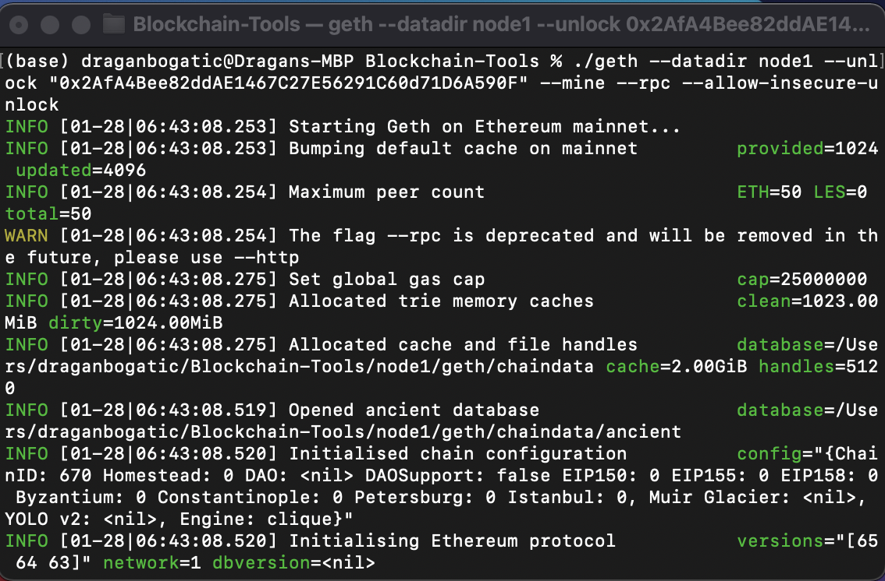
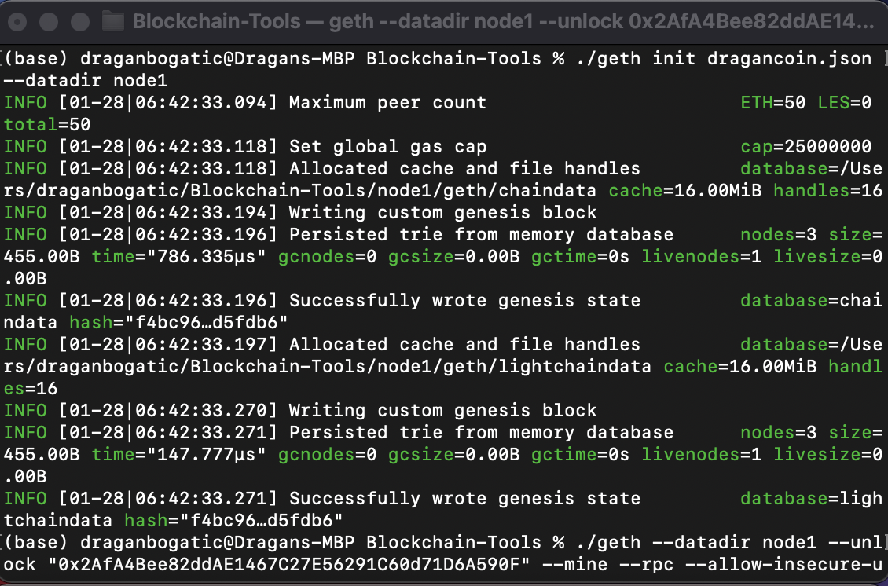
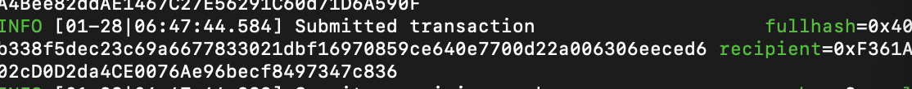
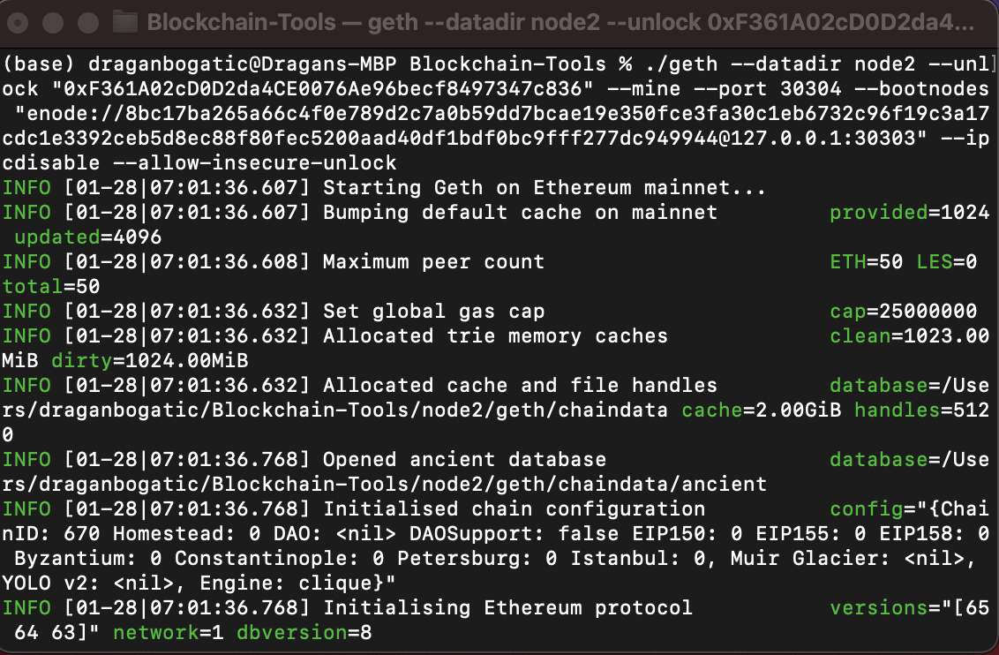
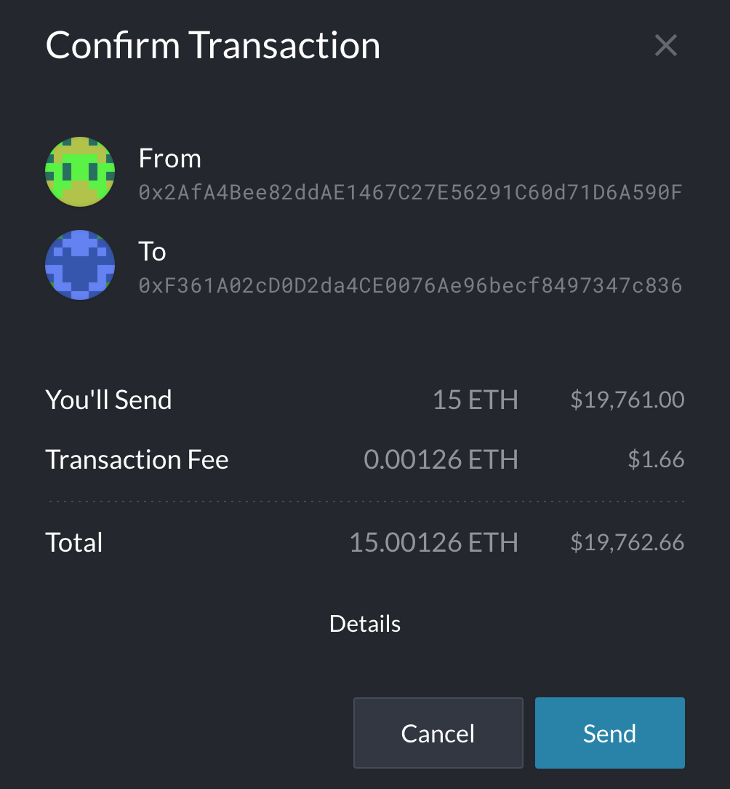

#
# Proof of Authority (PoA) Blockchain 

The goal of this repo is to show steps needed to set up a testnet blockchain for an organization using Geth and to simulate a crypto transaction on the ETH network via MyCrypto application. To do this, we will need to:

* Set up a custom PoA testnet blockchain with [Geth](https://geth.ethereum.org/).

* Send a test transaction.

* Verify that test transaction was recorded in our blockchain and registered in our [MyCrypto](https://mycrypto.com/account) wallet.

#
### Setting up a Proof of Authority (PoA) Blockchain with Geth
#
In order to setup our testnet blockchain we need to:

* Download and install [Geth]https://geth.ethereum.org/downloads/) into Blockchain-Tools folder.

* Next we use puppeth, to name our network and generate the initial genesis block. The following steps will accomplish this:

    * We name the network (in this case we named it dragoncoin).

*  `./puppeth`

    

    * Then, we configure the new genesis by selecting a consensus algorithm (in our case we use Proof of Authority).

    * We also select accounts that will be included in the blockchain and decide if they should be pre-funded.

    

    * Lastly, we will set a custom network id (we chose a random number 670) and export our network (we can ignore the error messages because we only need files that were created to setup our Nodes)

    
    

* Use Geth, a command-line tool, to create keys, initialize nodes, and connect the nodes together.

    * We use the following two lines of code to setup Node1 and Node2 that will interact in our blockchain.

    * `./geth account new --datadir node1`
    * `./geth account new --datadir node2`

* 

    Next, we initialize the nodes we created:

    * `./geth init dragancoin.json --datadir node1`

* 

    * `./geth init dragancoin.json --datadir node2`

* 

* Setup the Clique Proof of Authority consensus algorithm.

    * A consensus algorithm is a procedure through which all the peers of the Blockchain network reach a common agreement about the present state of the distributed ledger. Source: [Geeks for Geeks](https://www.geeksforgeeks.org/consensus-algorithms-in-blockchain/)

    * There are [three](https://www.geeksforgeeks.org/consensus-algorithms-in-blockchain/) consensus algorithms currently in use:
    
        * PoA (Proof of Authority) 
        * PoW (Proof of Work)
        * PoS (Proof of Stake)

    * In this case we will use PoA consensus algorithm which is setup once we initiated Node1 and Node2. 

    * The setup process includes selecting passwords for access to Node1 and Node2 as well as creation of Public and Secret keys, which are stored in the Keystore folder in each Node.

* 
Image Source:[Rice Bootcamp Student Activity Page](hhttps://rice.bootcampcontent.com/Rice-Coding-Bootcamp/rice-hou-fin-pt-09-2020-u-c/raw/master/class/18-Blockchain/3/Activities/03-Stu_Nodes_Accounts/Images/geth-account-new.png)

    * You should keep the account Private Key always in a secure location and not allow access to it to anyone (the image above is a sample image, yours will have different values)

#
### Send a Test Transaction
#
* Once we setup our Node 1 and Node 2, created passwords and initiated Nodes, we can start the blockchain. We do this by opening two terminals, where the first will be our mining Node 1 and the second one will be the transaction Node 2.

    * Starting the mining Node1:

* `./geth --datadir node1 --unlock "0x2AfA4Bee82ddAE1467C27E56291C60d71D6A590F" --mine --rpc --allow-insecure-unlock`

    * The password we set when we initialized each Node we use when we start the blockchain.

* 

* 

    * Starting the transaction Node2:

* `./geth --datadir node2 --unlock "0xF361A02cD0D2da4CE0076Ae96becf8497347c836" --mine --port 30304 --bootnodes "enode://97b3c74f436ec65417386497c8e88e0d5590dd16d1d0112306df56e65b45b4d12bc21fb00fa6f99b657ba8269867e043aee862b6d0812beb1685d0c9620caa2c@127.0.0.1:30303" --ipcdisable --allow-insecure-unlock`

    * We can find Node1 enode value in the mining terminal when we activate it. Also, you can see that Node 1 is using 30304 port while we assign port 30304 to Node2.

* 

* 

    * Now we have our blockchain comprised of Node1 and Node2 up and running.

* 

* Next step is to setup a custom network "dragancoin" and connect to it from MyCrypto account so we can initiate the transaction from node1 to Node2.

* 

* Now we can send a transaction from the Node1 to Node 2.

    * First, we need to access the account by accessing our private key in the keystore folder and input the password for Node1 account. 

* 

    * The private key is located in the keystore folder in Node1 and Node2. 

* 

    * Then, we complete the transaction details, verify it and send.

* 

* 

    * The transaction has been broadcasted to the blockchain network.

* 

#
## Verification of Transaction Completion
#

* The last step is to verify in MyCrypto wallet that the transaction has been processed successfully. We do this by checking the TX status.

* 

